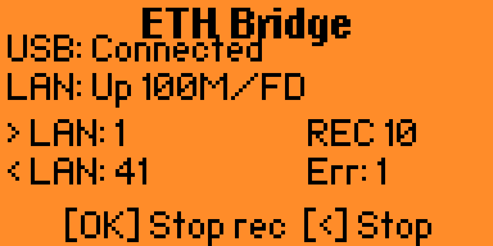

[← Back to documentation index](README.md)

# ETH Bridge Guide

The ETH Bridge turns Flipper Zero into a USB-to-Ethernet network adapter using the CDC-ECM (Communication Device Class -- Ethernet Control Model) protocol. A phone or PC connected to Flipper via USB gets transparent Layer 2 access to the LAN through the W5500 Ethernet port.

## How It Works

The bridge operates at Layer 2 (Ethernet frames), not Layer 3 (IP packets). This means:

- The connected host gets its own IP address from the LAN's DHCP server
- All protocols work transparently (HTTP, SSH, DNS, etc.)
- The Flipper acts as an invisible wire between USB and Ethernet
- No NAT, no routing, no IP configuration needed on the Flipper

### Data Flow

```
Phone/PC  ←→  USB (CDC-ECM)  ←→  Flipper  ←→  W5500 (SPI)  ←→  LAN (RJ45)
```

Frames received from USB are forwarded to the W5500 MACRAW socket. Frames received from W5500 are forwarded to USB. The Flipper's CPU handles the frame copying between the two interfaces.

## Usage

1. Connect the W5500 module and an Ethernet cable
2. Open **Tools → ETH Bridge** on the Flipper
3. The Flipper switches its USB profile from CDC Serial to CDC-ECM
4. Connect a phone or PC to the Flipper via USB
5. The host detects a new network interface and requests an IP via DHCP
6. Network traffic flows through the bridge

### On-Screen Display

While the bridge is running, the screen shows:

- **USB**: connection state (Connected / Not connected)
- **LAN**: link status, speed, duplex
- **USB → LAN**: frame counter (frames forwarded from USB to Ethernet)
- **LAN → USB**: frame counter (frames forwarded from Ethernet to USB)
- **Errors**: SPI/USB error counter



### Controls

- **OK**: toggle PCAP recording on/off
- **Back**: stop the bridge and restore USB

## PCAP Recording

Press **OK** during bridge operation to start recording all bridged traffic to a `.pcap` file on the SD card.

- Files are saved to `/ext/apps_data/lan_tester/pcap/`
- Filename format: `bridge_YYYYMMDD_HHMMSS.pcap`
- Compatible with Wireshark, tcpdump, and other PCAP analysis tools
- Press **OK** again to stop recording

The PCAP file captures frames from **both directions** (USB→LAN and LAN→USB), providing a complete view of the bridged traffic.

**Note**: recording to SD card while bridging adds some latency due to SD write operations. For maximum throughput, run without recording.

## Platform Compatibility

| Platform | Support | Notes |
|----------|---------|-------|
| **Linux** | Native | CDC-ECM recognized automatically, no drivers needed |
| **macOS** | Native | CDC-ECM recognized automatically |
| **Android** | Works | Most devices with USB OTG support CDC-ECM natively |
| **Windows** | Limited | No built-in CDC-ECM driver. May work with third-party RNDIS/ECM drivers |
| **iOS** | Not supported | iOS does not support USB Ethernet adapters via CDC-ECM |

### Linux Quick Start

```bash
# The interface appears automatically (e.g., usb0 or enp0sXXX)
# Get an IP via DHCP:
sudo dhclient usb0

# Or use NetworkManager:
nmcli device connect usb0
```

### Android

Connect via USB OTG cable or adapter. Most Android devices from 2018+ support CDC-ECM natively. The network connection appears in Settings → Network automatically.

## USB Profile Management

When the bridge starts, the Flipper saves its current USB profile (typically CDC Serial used for CLI/qFlipper) and switches to CDC-ECM. When you press **Back** to exit:

1. The bridge stops
2. USB is switched back to the original profile
3. CLI and qFlipper connectivity is restored

If the app crashes or the Flipper is reset, the USB profile may remain as CDC-ECM. Restarting the Flipper will restore the default profile.

## Performance Considerations

The main throughput bottleneck is the SPI bus between the Flipper's STM32 and the W5500:

- SPI clock: ~8 MHz
- Theoretical max: ~1 MB/s
- Practical throughput: 300-500 KB/s depending on frame sizes

This is sufficient for browsing, SSH, file transfers, and most normal network activities. It will not saturate a 100 Mbps Ethernet link.

## Use Cases

- **Give a phone LAN access**: connect an Android phone to a wired network via Flipper
- **Network troubleshooting**: use a laptop to access a network segment that only has wired ports, using Flipper as an adapter
- **Traffic capture**: record PCAP dumps of traffic passing through the bridge for analysis in Wireshark
- **Portable network tap**: see what traffic a device generates by bridging it through the Flipper with PCAP recording
