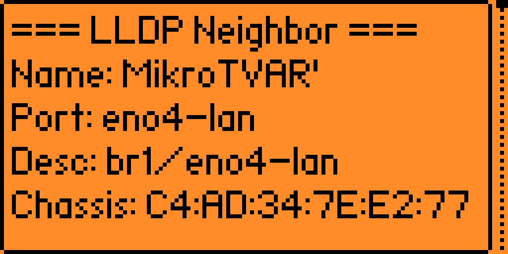

[← К содержанию](README.md)

# Руководство по функциям

## Начало работы

1. Подключите модуль W5500 к Flipper Zero (см. [Оборудование](hardware.md))
2. Вставьте Ethernet-кабель в RJ45-разъём W5500
3. Откройте **GPIO → LAN Tester** на Flipper
4. Заголовок меню показывает статус линка: `LAN [UP 100M FD]` или `LAN [DOWN]`
5. Выберите категорию, затем функцию


Меню организовано в четыре категории: **Network Info**, **Discovery**, **Diagnostics** и **Tools**. Большинство функций, требующих IP-адрес, запускают DHCP автоматически при первом использовании, затем кешируют результат.

### Навигация

- **Вверх/Вниз**: прокрутка пунктов меню
- **OK**: выбор пункта или подтверждение
- **Back**: возврат в родительское меню или отмена текущей операции
- **Влево/Вправо**: переключение опций (в настройках и выборе PXE-файла)

---

## Network Info

### Link Info

Показывает текущее состояние физического Ethernet-соединения.

**Вывод:**
- **Link**: UP или DOWN
- **Speed**: 10 Мбит/с или 100 Мбит/с
- **Duplex**: Half или Full
- **MAC Address**: текущий MAC-адрес W5500 (сохраняется на SD)
- **W5500 Version**: регистр версии чипа (должен быть `0x04`)

**Используйте первым** после подключения оборудования для проверки, что W5500 обнаружен и кабель подключён.

### DHCP Analyze

Отправляет DHCP Discover и парсит Offer **без принятия аренды**. Полностью безопасно для продакшн-сетей -- IP-адрес не занимается.

**Вывод:**
- Предложенный IP-адрес
- IP DHCP-сервера
- Маска подсети
- Шлюз
- DNS-сервер(ы)
- NTP-сервер (если предоставлен)
- Доменное имя (если предоставлено)
- Время аренды
- Фингерпринт DHCP-опций (список номеров опций)

**Таймаут**: 15 секунд. Если Offer не получен, показывает "DHCP: No response".

Результат DHCP кешируется и переиспользуется всеми другими функциями.

### Statistics

Захватывает все Ethernet-фреймы в течение 10 секунд и показывает статистику.

**Вывод:**
- Общее количество фреймов
- По назначению: unicast, broadcast, multicast
- По EtherType: IPv4, ARP, IPv6, LLDP, CDP, unknown

Использует MACRAW-сокет в промискуитетном режиме -- видит весь трафик на линии, не только адресованный Flipper.

---

## Discovery

### ARP Scan

Сканирует локальную подсеть для обнаружения активных хостов.

**Как работает:**
1. Запускает DHCP (если не закеширован) для определения диапазона подсети
2. Отправляет ARP-запросы пакетами (16 запросов за 15 мс)
3. Ждёт ответы с таймаутом для опоздавших
4. Показывает каждый обнаруженный хост: IP, MAC (последние 3 байта), имя вендора (OUI)

**Пример вывода:**
```
[ARP] 192.168.1.0/24 (254 hosts)
192.168.1.1   AA:BB:CC  Cisco
192.168.1.10  DD:EE:FF  Intel
192.168.1.42  11:22:33  Apple
Found: 3 hosts
```

Обнаруженные хосты сохраняются в интерактивный список -- см. [Интерактивный список хостов](#интерактивный-список-хостов).

### Ping Sweep

ICMP-свип всего CIDR-диапазона.

**Ввод**: CIDR-нотация (напр. `192.168.1.0/24`). Автоопределяется из DHCP или вводится вручную через IP-клавиатуру.

**Как работает:**
1. Отправляет один ICMP Echo Request на каждый IP в диапазоне
2. Ждёт ответы с настраиваемым таймаутом
3. Показывает прогрессбар во время сканирования
4. Выводит список ответивших хостов

Обнаруженные хосты попадают в интерактивный список.

### LLDP/CDP

Пассивный слушатель протоколов обнаружения соседей на свитчах.

**LLDP** (Link Layer Discovery Protocol, IEEE 802.1AB): используется большинством управляемых свитчей для объявления своей идентификации. **CDP** (Cisco Discovery Protocol): проприетарный аналог от Cisco.

**Как работает:**
1. Открывает MACRAW-сокет в промискуитетном режиме
2. Слушает до 60 секунд (обратный отсчёт на экране)
3. Парсит полученные LLDP/CDP-фреймы

**Вывод LLDP** (типы TLV 0-8, 127):
- Имя системы, описание
- ID порта, описание порта
- IP управления
- Возможности системы (bridge, router и т.д.)
- Имя и ID VLAN (802.1Q TLV)

**Вывод CDP:**
- Device ID, платформа
- Port ID
- IP управления
- Версия ПО
- Native VLAN



Нажмите **Back** для досрочного прекращения прослушивания.

### mDNS/SSDP Discovery

Обнаружение сервисов и устройств в локальной сети через два multicast-протокола.

**mDNS**: отправляет запрос `_services._dns-sd._udp.local` на 224.0.0.251:5353. Находит принтеры, AirPlay-устройства, Home Assistant и др.

**SSDP**: отправляет M-SEARCH на 239.255.255.250:1900. Находит UPnP-устройства, медиасерверы, хабы умного дома.

Собирает ответы примерно 10 секунд.

### STP/VLAN

Пассивный слушатель Spanning Tree Protocol и VLAN-тегов.

**STP/RSTP/MSTP**: слушает BPDU-фреймы 30 секунд. Показывает:
- ID и приоритет корневого моста
- ID отправляющего свитча
- Роль и состояние порта
- Стоимость пути
- Версия протокола (STP/RSTP/MSTP)

**802.1Q VLAN**: определяет VLAN-теги на любом проходящем Ethernet-фрейме. Показывает VLAN ID и приоритет.

---

## Diagnostics

### Ping

Отправляет ICMP Echo Request на целевой IP.

**Цель по умолчанию**: шлюз из DHCP (предзаполнен в поле ввода).

**Настраивается** (в Settings):
- **Count**: 1-100 пакетов (по умолчанию: 4)
- **Timeout**: 500-10000 мс на пакет (по умолчанию: 3000 мс)

**Вывод**: RTT для каждого пакета и сводка (отправлено/получено/потеряно, min/avg/max RTT).

### Continuous Ping

Непрерывный пинг с живым графиком RTT.

**Ввод**: целевой IP (по умолчанию: шлюз из DHCP).

**Отображение:**
- 128-пиксельный график RTT, прокручивающийся справа налево
- Текущее значение RTT
- Среднее RTT
- Процент потерь пакетов
- Min/max RTT

**Настраивается** (в Settings):
- **Interval**: 200-5000 мс между пингами (по умолчанию: 1000 мс)

Работает непрерывно до нажатия **Back**.

### DNS Lookup

Разрешение доменного имени в IP-адрес через UDP DNS.

**Ввод**: доменное имя (напр. `google.com`)

**DNS-сервер**: из DHCP, или пользовательский, если настроен в Settings.

**Вывод**: разрешённый IPv4-адрес или сообщение об ошибке.

### Traceroute

ICMP-трассировка маршрута с пошаговым обнаружением пути.

**Ввод**: IP-адрес или доменное имя (имена разрешаются через DNS).

**Как работает:**
1. Отправляет ICMP Echo Request с инкрементирующимся TTL (начиная с 1)
2. Каждый маршрутизатор на пути отвечает ICMP Time Exceeded
3. Записывает IP и RTT каждого хопа
4. Останавливается на TTL 30 или при ответе от целевого хоста

**Пример вывода:**
```
[Traceroute] 8.8.8.8
 1  192.168.1.1      2 ms
 2  10.0.0.1         8 ms
 3  *                timeout
 4  8.8.8.8          15 ms
Done: 4 hops
```

### Port Scanner

TCP connect-сканирование для обнаружения открытых портов.

**Ввод**: целевой IP (по умолчанию: шлюз из DHCP).

**Режимы сканирования:**
- **Top 20**: 18 наиболее распространённых портов (SSH, HTTP, HTTPS, SMB, RDP и т.д.) -- быстрый скан
- **Top 100**: 100 популярных портов -- полный скан
- **Custom**: любой диапазон от 1 до 65535

**Как работает:**
1. Пытается TCP-подключение к каждому порту
2. Короткий таймаут на порт (~2-3 секунды)
3. Показывает прогрессбар
4. Выводит список открытых портов с именами сервисов

---

## Tools

### Wake-on-LAN

Отправка WoL magic-пакета для пробуждения устройства в сети.

**Ввод**: целевой MAC-адрес (через byte input).

Magic-пакет отправляется как broadcast UDP на порт 9. На целевой машине должен быть включён WoL в BIOS/UEFI и настройках сетевого адаптера.

### Packet Capture

Автономный захват трафика в формате PCAP без ETH Bridge.

Открывает MACRAW-сокет в промискуитетном режиме и записывает все принятые Ethernet-фреймы в `.pcap` файл на SD-карте. Файлы сохраняются в `apps_data/lan_tester/pcap/` с именами по метке времени.

Файлы `.pcap` совместимы с Wireshark и tcpdump.

Нажмите **OK** для старта/остановки записи. **Back** для выхода.

### Другие инструменты

- **[ETH Bridge](eth-bridge.md)** -- USB-Ethernet мост с опциональной записью PCAP
- **[PXE Server](pxe-server.md)** -- сервер сетевой загрузки с DHCP + TFTP
- **[Файловый менеджер](file-manager.md)** -- веб-управление файлами SD через HTTP

---

## Интерактивный список хостов

Когда ARP Scan или Ping Sweep обнаруживают хосты, они сохраняются в интерактивный список. Выберите любой хост для выполнения действий:


- **Ping** -- быстрый тест 4 пинга к этому хосту
- **Continuous Ping** -- живой график RTT к этому хосту
- **Traceroute** -- трассировка пути к этому хосту
- **Port Scan** -- сканирование портов этого хоста
- **Wake-on-LAN** -- отправка magic-пакета на MAC этого хоста (если известен)

В списке может храниться до 64 хостов.

---

## Settings

Доступ через главное меню → **Settings**.

| Настройка | Значения | По умолчанию | Описание |
|-----------|----------|--------------|----------|
| Auto-save results | ON / OFF | ON | Автосохранение результатов в историю |
| Sound & vibro | ON / OFF | ON | LED-мигание и вибрация при завершении/ошибке |
| Custom DNS | ON / OFF | OFF | Использовать свой DNS вместо полученного по DHCP |
| DNS Server IP | IP-адрес | 8.8.8.8 | Пользовательский DNS (только при Custom DNS = ON) |
| Ping Count | 1-100 | 4 | Количество ICMP-пакетов для Ping |
| Ping Timeout | 500-10000 мс | 3000 | Таймаут ответа на пакет |
| Cont. Ping Interval | 200-5000 мс | 1000 | Интервал между пингами в Continuous Ping |
| Clear History | действие | -- | Удалить все сохранённые результаты |
| MAC Changer | действие | -- | Случайный или ручной MAC; сохраняется на SD |

### MAC Changer

При первом запуске приложение генерирует уникальный случайный locally-administered MAC-адрес через аппаратный ГСЧ и сохраняет его в `mac.conf` на SD-карте. MAC Changer позволяет:

- **Randomize**: сгенерировать новый случайный MAC
- **Custom**: ввести любой MAC-адрес через byte input

Новый MAC применяется немедленно и сохраняется между перезапусками приложения. Он используется ETH Bridge и всеми сетевыми операциями.
